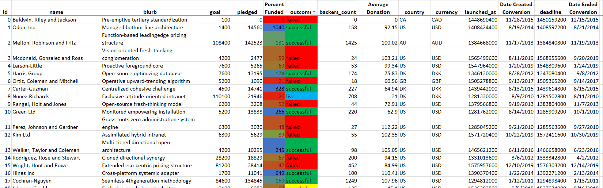
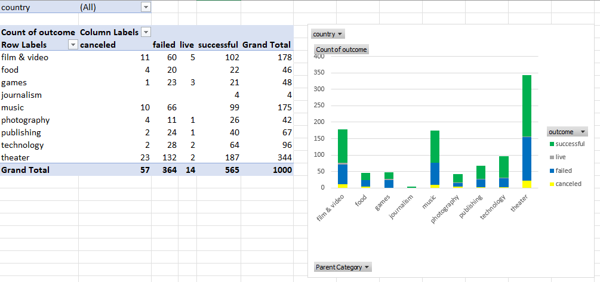
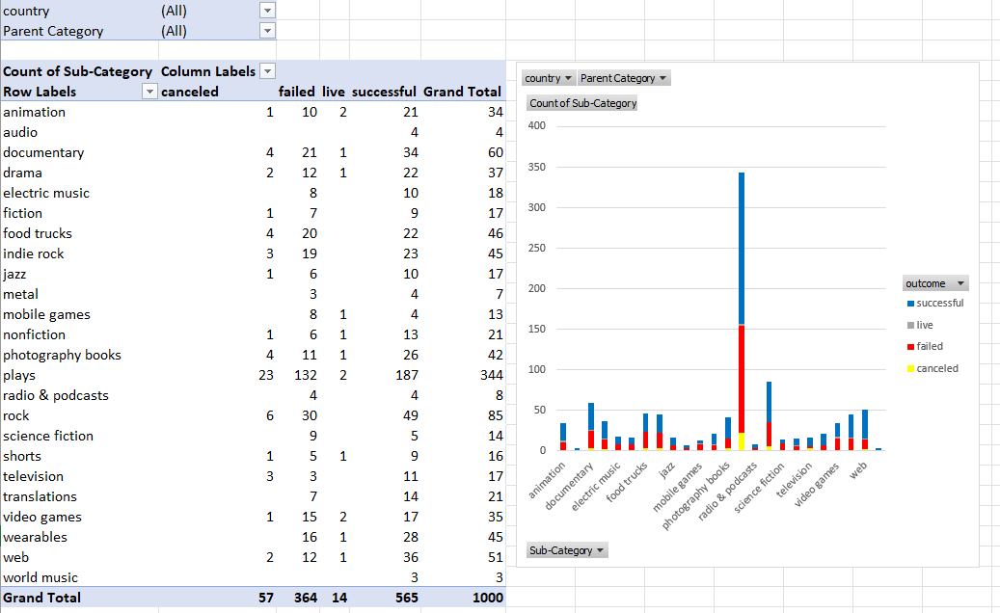
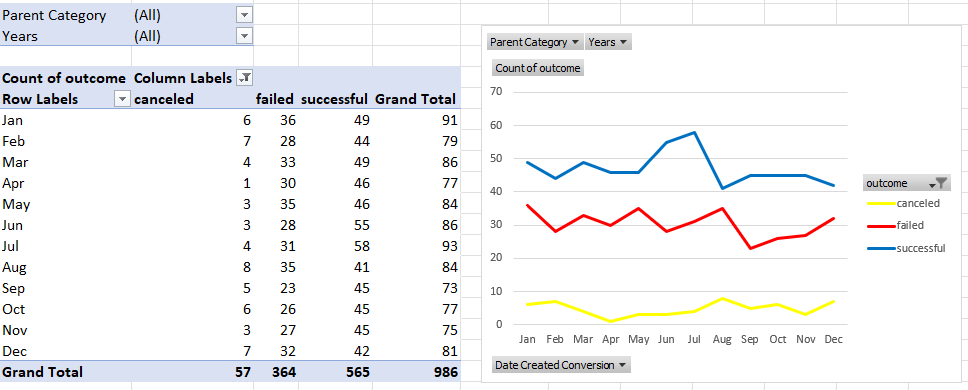
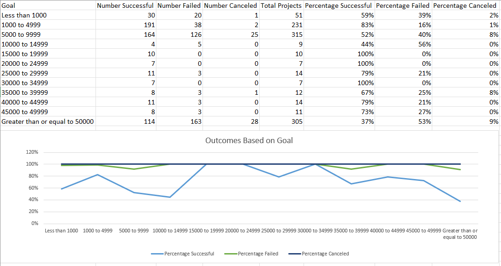
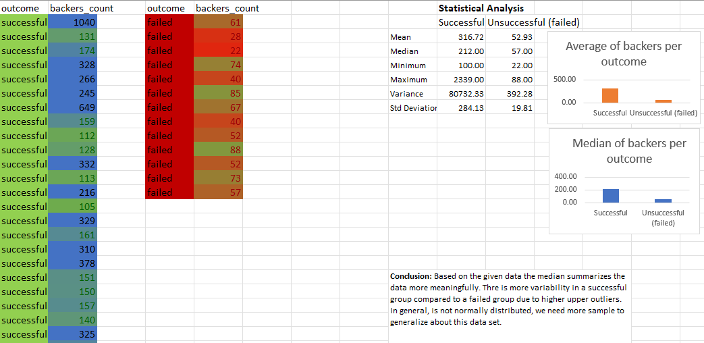

# Excel-Homework
Background
Crowdfunding platforms like Kickstarter and Indiegogo have been growing in success and popularity since the late 2000s. From independent content creators to famous celebrities, more and more people are using crowdfunding to launch new products and generate buzz, but not every project has found success.

To receive funding, the project must meet or exceed an initial goal, so many organizations dedicate considerable resources looking through old projects in an attempt to discover “the trick” to finding success. For this week's Challenge, you will organize and analyze a database of 1,000 sample projects to uncover any hidden trends.

Solution
Conditional formatting was implimented to fill in each cell in the "state" and "Percent Funded" column with different color, depending on whether the associated campaign was successful, failed, or canceled, or is currently live. The "Percent Funded" also is newly created to uncover how much money a campaign made to reach its initial goal.

Conditional Formating

Another column I called "Average Donation" was created that uses a formula to uncover how much each backer for the project paid on average.

Two new columns, one called "Category" at S and another called "Sub-Category" at T, which uses formulas to split the "Category and Sub-Category" column into two-part was created.

A pivotal table was analyzed, and implemented to see the initial worksheet to count how many campaigns were successful, failed, canceled, or are currently live per category. In addition to that, a stacked column pivot chart that can be filtered by country based on the table has been created.

A new sheet with a pivot table was created and analyzed the initial sheet to count how many campaigns were successful, failed, or canceled, or are currently live per sub-category. In addition to that, a stacked column pivot chart was created that can be filtered by country and parent-category.

The format of dates stored within the "deadline" and "launched_at" columns was converted from Unix timestamps format into Excel's date format and new columns named "Date Created Conversion" and "Date Ended Conversion" was created respectively.

A new sheet with a pivot table was created with a column of "state",rows of "Date Created Conversion", values based on the count of "state", and filtered based on "parent category" and "Years". Subsequently, a pivot chart line graph that visualizes this new table was created. "Date Created Conversion", values based on the count of "state", and filtered based on "parent category" and "Years". Subsequently, a pivot chart line graph that visualizes this new table was created.

A new worksheet was created to compare the count of successful, failed, and canceled campaign outcomes across the goal. For this task, a "COUNTIFS()" formula was used to accomplish the task. To visualize the effect a line graph was created and displayed.

Statistical analysis was implemented and visualized to compare how successful, and failed campaign outcomes varied across the number of backers count. Mean, median, minimum, maximum, variance, the standard deviation was calculated. At last, the outlier test is conducted to determine whether the mean or median summarizes the data meaningfully.

<b>Conclusions</b>

Conclusion 1
The Kickstarter campaign has shown a higher frequency in the theater category compared to other groups.In the data next to theater music, film and video is most prevalent. These may be due to theater is the best-suited place to get a lot of people at once and conduct a campaign.

Conclusion 2
In general, the Kickstarter campaign has greater success than failed, canceled, or live. However, the sample size is yet limited to generalize. 

Conclusion 3
The time serious analysis of Kickstarter campaign has shown successful result in July. This may due to summer people start to go out for entertainment or theater. In the other category the begining’s of the year are the peak it may be due to a new year resolution started to be implemented.

Limitations of the dataset: 
This dataset only includes a small sample of the population from all projects. To have a better insight, we need more samples.
